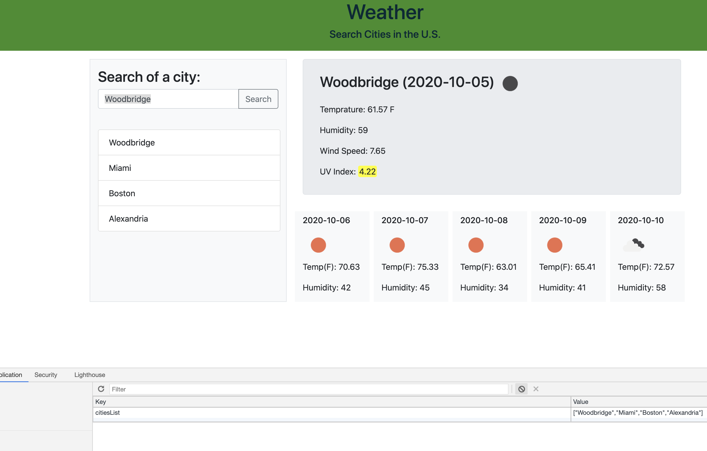

# Weather-app

Search for a city in the U.S. get current weather and 5 days forecast for that city. All searched cities are stored in localStorage and the last one entered witll be on screen.

# How Does It Work?

* Connect to the weather API (openweathermap.org) to get information about the current weather and the weather for the next five days
* Each searched item will be stored in the "History list" (localStorage)

# Links:

* [repo on GitHub](https://github.com/samergain/weather-app/)
* [deployed application](https://samergain.github.io/weather-app/)

# Screenshot 

# Future Improvements:
* Improve the forecast function to return only days with 12.00 time 
* Prevent entring invalid city name (values with no response).

